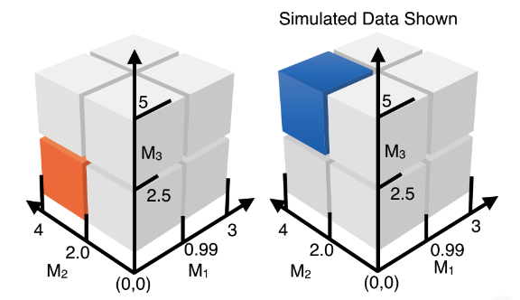

---
output:
  rmarkdown::github_document:
    pandoc_args: --webtex
bibliography: "inst/REFERENCES.bib"
always_allow_html: true
---

<!-- README.md is generated from README.Rmd. Please edit that file -->

```{r, echo = FALSE}
knitr::opts_chunk$set(
  collapse = TRUE,
  comment = "#>",
  fig.path = "README-"
)
```

# `R/CVtreeMLE` 

<!-- badges: start -->
[](https://github.com/blind-contours/CVtreeMLE/actions)
[](https://codecov.io/github/blind-contours/CVtreeMLE?branch=master)
[](https://www.r-pkg.org/pkg/CVtreeMLE)
[](https://CRAN.R-project.org/package=CVtreeMLE)
[](https://CRAN.R-project.org/package=CVtreeMLE)
[](https://www.repostatus.org/#active)
[](https://opensource.org/licenses/MIT)
[](https://doi.org/10.5281/zenodo.4070042)
[](https://doi.org/10.21105/joss.02447)
<!-- badges: end -->

> Efficient Estimation of the Causal Effects of Joint Exposure using Data Adaptive Decision Trees and Cross-Validated Targeted Maximum Likelihood Estimation
__Authors:__ [David McCoy](https://davidmccoy.org)

---

## What is `CVtreeMLE`?

The `CVtreeMLE` (Cross-Validated Decision Trees with Targeted Maximum Likelihood
Estimation) R package is designed to provide statistical software for the construction
of efficient estimators from data adaptive decision trees. The target parameter is the
average treatment effect (ATE) causal parameter defined as the counterfactual mean 
outcome if all individuals were jointly exposed to a combination of exposure levels in a mixed exposure compared to if all
individuals were not exposed. Here, the levels of a joint exposure are data-adaptively identified 
based on decision trees applied to a set of exposure variables while flexibly 
controlling for covariates non-parametrically. For more information on data-
adaptive parameters see [@Hubbard2016]. `CVtreeMLE` uses data-adaptive parameters 
by implementing V-fold cross-validation (CV), that is, in 10-fold CV, the data is split 10 
times (folds), where 90\% of the data is used to determine rules in a mixture, and the $g$ and $Q$
estimators needed for the ATE. These rules and estimators created in training data are applied to the validation data in order to calculate the final ATE target parameter. In order to optimize the optimum bias-variance trade-off for our causal parameter of interest we use cross-validated targeted minimum loss based estimation (CV-TMLE). `CVtreeMLE` builds off of the  CV-TMLE general theorem of [cross-validated minimum loss based estimation](https://biostats.bepress.com/cgi/viewcontent.cgi?article=1276&context=ucbbiostat) [@Zheng2010] which allows the full utilization of loss based super learning to obtain the initial estimators needed for our target parameter without risk of overfitting. Thus, `CVtreeMLE` makes possible the non-parametric estimation of the causal effects of a mixed exposure that both results in interpretable results which are useful for public policy and is asymptotically efficient. 

`CVtreeMLE` integrates with the [`sl3`package](https://github.com/tlverse/sl3) [@coyle2021sl3]
to allow for ensemble
machine learning to be leveraged in the estimation procedure. `sl3` is used in 
the iterative backfitting procedure because this step requires ensemble machine 
learning with an offset for the decision tree predictions. In the $Q$ and $g$ mechanisms, 
`CVtreeMLE` uses the legacy [`Super Learner`
package](https://github.com/tlverse/SuperLearner) [@coyle2021sl3]. In the iterative
backfitting procedure, for decision tree fitting on the full mixture modeled 
together, the [`pre` package](https://github.com/marjoleinF/pre)[@Fokkema2020a] is used to fit rule
ensembles. In backfitting procedure to find thresholds in each mixture component
individually, the [`partykit` package](http://partykit.r-forge.r-project.org/partykit/)[partykit2015]. In both instances,trees can be estimated with an offset for ensemble machine learning predictions.

---

## Installation

For standard use, we recommend installing the package from
[CRAN](https://CRAN.R-project.org/package=CVtreeMLE) via

```{r cran-installation, eval = FALSE}
install.packages("CVtreeMLE")
```

_Note:_ If `CVtreeMLE` is installed from
[CRAN](https://CRAN.R-project.org/package=CVtreeMLE), the `sl3`, an enhancing
dependency that allows ensemble machine learning to be used for nuisance
parameter estimation, won't be included. We highly recommend additionally
installing `sl3` from GitHub via
[`remotes`](https://CRAN.R-project.org/package=remotes):

```{r sl3-gh-master-installation, eval = FALSE}
remotes::install_github("tlverse/sl3@master")
```

For the latest features, install the most recent _stable version_  of `CVtreeMLE`
from GitHub via [`remotes`](https://CRAN.R-project.org/package=remotes):

```{r gh-master-installation, eval = FALSE}
remotes::install_github("blind-contours/CVtreeMLE@master")
```

To contribute, install the _development version_ of `CVtreeMLE` from GitHub via
[`remotes`](https://CRAN.R-project.org/package=remotes):

```{r gh-devel-installation, eval = FALSE}
remotes::install_github("blind-contours/CVtreeMLE@devel")
```

---

## Example

To illustrate how `CVtreeMLE` may be used to ascertain the effect of a joint exposure,
consider the following example:

First load the package and other packages needed
```{r libraries, warning=FALSE}
library(CVtreeMLE)
library(sl3)
library(kableExtra)
library(ggplot2)
library(jtools)


set.seed(429153)
```

Use the `simulate_mixture_cube` function to generate simulated data that represents ground-truth. Here, we create three continuous mixture variables, $A$, that are correlated and baseline covariates, $W$, that are potential confounders. Our outcome will be generated such that individuals with a specific set of exposures have a different outcome compared to individuals who are not exposed to this combination of exposure levels. 



The above figure illustrates the data we will generate using this function. Here, individuals exposed to $M_1$ at values less than 1.0, $M_2$ at levels more than 2.0, and $M_3$ at levels at or greater than 2.5 have an outcome of 6, compared to individuals not exposed to this combination of thresholds who have an expected outcome of 0 - thus our ATE is 6. Two covariates $W$ confound this relationship. Let's simulate this scenario.

## Simulate Data

```{r simulation inputs}
n_obs <- 500 # number of observations we want to simulate
splits <- c(0.99, 2.0, 2.5) # split points for each mixture
mins <- c(0, 0, 0) # minimum values for each mixture
maxs <- c(3, 4, 5) # maximum value for each mixture
mu <- c(0, 0, 0) # mu for each mixture
sigma <- matrix(c(1, 0.5, 0.8, 0.5, 1, 0.7, 0.8, 0.7, 1), nrow = 3, ncol = 3) # variance/covariance of mixture variables
w1_betas <- c(0.0, 0.01, 0.03, 0.06, 0.1, 0.05, 0.2, 0.04) # subspace probability relationship with covariate W1
w2_betas <- c(0.0, 0.04, 0.01, 0.07, 0.15, 0.1, 0.1, 0.04) # subspace probability relationship with covariate W2
mix_subspace_betas <- c(0.00, 0.08, 0.05, 0.01, 0.05, 0.033, 0.07, 0.09) # probability of mixture subspace (for multinomial outcome generation)
subspace_assoc_strength_betas <- c(0, 0, 0, 0, 0, 0, 6, 0) # index is the subspace to apply the outcome value to
marginal_impact_betas <- c(0, 0, 0) # marginal impact of mixture component on Y
eps_sd <- 0.01 # random error
binary <- FALSE # if outcome is binary
```

Above, the `subspace_assoc_strength_betas` parameter is used to indicate the subspace we want to use and the expected outcome in that subspace. The indices correspond to an area in the cube:

1.  All mixtures lower than specified thresholds
2.  M1 is higher but M2 and M3 are lower
3.  M2 is higher but M1 and M3 are lower
4.  M1 and M2 are higher and M3 is lower
5.  M3 is higher and M1 and M2 are lower
6.  M1 and M3 are higher and M2 is lower
7.  M2 and M3 are higher and M1 is lower
8.  All mixtures are higher than thresholds

In the current simulation, the threshold for $M_1$ is 0.99, $M_2$ is 2.0, and $M_3$ is 2.5. Therefore, if we were to specify, `subspace_assoc_strength_betas <- c(0, 3, 0, 0, 0, 0, 0, 0)`, we would simulate an outcome that is 3 where $M_1$ is greater than 1 and  $M_2$ and  $M_3$ are less than 2.0 and 2.5 respectively. Now we can simulate the scenario shown in the figure with: 
`subspace_assoc_strength_betas <- c(0, 0, 0, 0, 0, 0, 6, 0)` with additional confounding by $W$ and random error. 

```{r simulate data, warning=FALSE}
sim_data <- simulate_mixture_cube(
  n_obs = n_obs, 
  splits = splits,
  mins = mins,
  maxs = maxs,
  mu = mu,
  sigma = sigma,
  w1_betas = w1_betas,
  w2_betas = w2_betas,
  mix_subspace_betas = mix_subspace_betas,
  subspace_assoc_strength_betas = subspace_assoc_strength_betas,
  marginal_impact_betas = marginal_impact_betas,
  eps_sd = eps_sd,
  binary = binary
)

head(sim_data) %>%
  kbl(caption = "Simulated Data") %>%
  kable_classic(full_width = F, html_font = "Cambria")
```
## Set up Estimators used in Super Learners 

Here, we set up our Super Learner using `SL3` for the iterative backfitting procedure. These learners will fit $Y|W$ offset by $Y|A$ as we fit decision trees to the exposure variables both jointly and individially.

```{r setup first stack learners}
lrnr_glm <- Lrnr_glm$new()
lrnr_bayesglm <- Lrnr_bayesglm$new()
lrnr_gam <- Lrnr_gam$new()
lrnr_lasso <- Lrnr_glmnet$new(alpha = 1)
lrnr_earth <- Lrnr_earth$new()
lrnr_ranger <- Lrnr_ranger$new()
lrnr_xgboost100 <- Lrnr_xgboost$new(nrounds = 100, early_stopping_rounds = 10)
lrnr_xgboost50 <- Lrnr_xgboost$new(nrounds = 50, early_stopping_rounds = 5)
lrnr_xgboost20 <- Lrnr_xgboost$new(nrounds = 20)
# put all the learners together (this is just one way to do it)
learners <- c(lrnr_glm, lrnr_bayesglm,
lrnr_gam, lrnr_ranger,
lrnr_xgboost100, lrnr_xgboost50, lrnr_xgboost20)

Q1_stack <- make_learner(Stack, learners)
```

This second stack of learners will be used in our $Q$ and $g$ mechanisms after we identify rules using the first stack.

```{r setup second stack learners}

SL.library<- c('SL.randomForest',
               'SL.earth',
               "SL.glm",
               "SL.mean")
```

## Run `CVtreeMLE`

We will now pass the simulated data, learners, and variable names for each node in $O = W,A,Y$ to the `CVtreeMLE` function:

```{r run simulation}
ptm <- proc.time()

sim_results <- CVtreeMLE(data = sim_data,
                                   W = c("W", "W2"),
                                   Y = "y",
                                   A = c(paste("M", seq(3), sep = "")),
                                   back_iter_SL = Q1_stack,
                                   SL.library = SL.library,
                                   n_folds = 5,
                                   family = "gaussian",
                                   H.AW_trunc_lvl = 10,
                                   parallel = TRUE,
                                   verbose = FALSE)

proc.time() - ptm

```

## Types of Models

`CVtreeMLE` fits four types of models: 

1. $Y|M_i, W$ or the expected $Y$ given $M_i$ and covariates $W$ where other mixture components $M_{\ne i}$ are controlled for - these are marginal rule models. That is, decision trees are fit to mixture component $M_i$ and Super Learner is fit to $Y|M_{\ne =i}, W$ in the iterative back-fitting procedure. In this way, we derive individual rules for each mixture compenent while controlling for other mixture components and W. 

2. $Y|M, W$ or the expected Y given $M$ and covariates $W$ where all mixture components are modeled collectively in ensemble partitioning while controlling for $W$ - these are mixture rule models (multiple mixture variables included in a rule compared to 1. above). That is, decision trees are fit to the total mixture space and Super Learner is fit to $Y|W$ in the iterative back-fitting procedure. In this way, we derive rules for the total mixture while controlling for $W$. 

3. The additive marginal model: this treats exposure as a cumulative sum of marginal rules found in the folds. That is, in each fold, the marginal fitting in model 1. is conducted, we simply sum up the rules found for each mixture component to derive an ordered factor variable that describes cumulative exposure. This is $Y| \sum_i^j A_i, W$ or the expected outcome given cumulative exposure while controlling for covariates.

4. The non-additive marginal model: It could in fact be the case that there are interactions between the mixture, as represented as a vector of indicators, and covariates $W$ or within the mixture itself. To capture this, we model $Y|M,W$ where now, each mixture variable $M$ is represented as a binary indicator of the rule determined within the fold. 

Of course, we want to only investigate statistical inference for our target parameter for models that have the best fit. As such, we want to review the RMSE for each of the models detailed above. 

```{r model RMSE}
RMSE_results <- sim_results$`Model RMSEs`
head(RMSE_results) %>%
  kbl(caption = "Model Fit Results") %>%
  kable_classic(full_width = F, html_font = "Cambria")

```

In the above table the first three rows correspond to model type 1., or marginal rules with respective RMSE. The fourth row corresponds to model type 2. or the RMSE of a Super Learner fit with the exposure being a mixture rule found when fitting decision trees on all the mixture components simultaneously. 

Lines five and six correspond to models 3. and 4. respectively. 

As we can see, the model fit with the mixture rule as the _lowest RMSE_, as we would expect given our simulated outcome was generated based on this rule. We can also see that the _rule matches what we simulated_.

## Mixture and Marginal Results

Let's first look at the mixture results for the model that had the lowest RMSE:

```{r mixture results}
mixture_results <- sim_results$`Mixture Results`
head(mixture_results) %>%
  kbl(caption = "Mixture Results") %>%
  kable_classic(full_width = F, html_font = "Cambria")
```
In this table, Mixture ATE is the counterfactual mean difference if everyone was exposed to this rule compared to if nobody was exposed to this rule. Mixture interaction rule is the final rule created that covers all individuals across the fold specific mixture rules. Coverage is what proportion of individuals are covered by this rule and is an indicator of rule stability. As we can see, `CVtreeMLE` identifies the correct rule in the simulated data and estimates the correct ATE with proper CI coverage.  

These are the rules found for each individual variable in the vector of exposures while controlling for other exposures and covariates. 

```{r marginal results}
marginal_results <- sim_results$`Marginal Results`
head(marginal_results) %>%
  kbl(caption = "Marginal Results") %>%
  kable_classic(full_width = F, html_font = "Cambria")
```

Across the folds, the expected outcome given the cumulative sum of marginal exposures is also estimated. That is, answering a question such as "What is the exposure specific mean for each additional exposure level".

```{r glm cumulative sum effects, fig.keep='all'}
summary(sim_results$`Additive MSM`)
```

As we can see, the expected ATE when modeled as a cumulative exposure does not match the simulations and has high RMSE, as we would expect given the simulated data. 

However, if this model did have the lowest RMSE we could investigate further the cumulative impact of exposure to the marginal rules. 

```{r plot cumulative sum effects, fig.keep='all'}
cumulative_sum_plot <- effect_plot(sim_results$`Additive MSM`, 
            pred = sum_marg_hits, 
            interval = TRUE, 
            y.label = "Expected Outcome",
            x.label = "Cumulative Exposure",
            cat.geom = "line",
            colors = "black")

cumulative_sum_plot

```

In the plot above, we see the expected outcome given exposure to none of the rules found for each individual variable, exposure to any 1 rule for $M_1$, $M_2$ or $M_3$, any two or all three. 

Lastly, it could be the case that model 4. has the lowest RMSE and we want to investigate the respective marginal ATE, or combination of rule exposures given that model. 

The `fit_post_counterfactuals` function takes in the `CVtreeMLE` results and uses the marginal combination data to calculate the ATE for new counterfactuals using the fits found across the CV procedure. Below, we run this to get ATE results if all individuals were exposed to the rules found for each variable in the simulation compared to if none were exposed when the marginal rules are modeled in a non-additive fashion. 

```{r fit post counterfactuals, warning= FALSE}
post_fit_counterfactuals <- fit_post_counterfactuals(modeling_results = sim_results, 
                         target_mixtures = c("M1", "M2", "M3"), 
                         H.AW_trunc_lvl = 10, 
                         SL.library = SL.library,
                         p_adjust_n = 1)

post_fit_counterfactuals %>%
  kbl(caption = "Post Counterfactual Results") %>%
  kable_classic(full_width = F, html_font = "Cambria")
```

As we can see, the ATE from this model does not match the truth in simulations and the RMSE is higher compared to the mixture rule fitting. However, if the RMSE for this model was lowest, one could then investigate the expected outcome under different combination of marginal exposures. 

## Vignette

For more details as to what's under the hood in `CVtreeMLE` please see the included vignette. There, additional applications are shown (on the NIEHS mixtures workshop data) and results are compared to existing mixture methods. 


---

## Issues

If you encounter any bugs or have any specific feature requests, please [file an
issue](https://github.com/blind-contours/CVtreeMLE/issues). Further details on filing
issues are provided in our [contribution
guidelines](https://github.com/blind-contours/CVtreeMLE/blob/master/CONTRIBUTING.md).

---

## Contributions

Contributions are very welcome. Interested contributors should consult our
[contribution
guidelines](https://github.com/blind-contours/CVtreeMLE/blob/master/CONTRIBUTING.md)
prior to submitting a pull request.

---

## Citation

After using the `CVtreeMLE` R package, please cite the following:

      
      @article{mccoyd2022CVtreeMLE-joss,
        author = {McCoy, David B; Hubbard, Alan; Van der Laan Mark},
        title = {{CVtreeMLE}: Efficient Estimation of Mixed Exposures using Data Adaptive Decision Trees and Cross-Validated Targeted Maximum Likelihood Estimation in {R}}
        year  = {2022},
        doi = {TBD},
        url = {TBD},
        journal = {Journal of Open Source Software},
        publisher = {The Open Journal}
      }

      @software{mccoyd2022CVtreeMLE-rpkg,
        author = {McCoy, David B; Hubbard, Alan; Van der Laan Mark},
        title = {{CVtreeMLE}: Efficient Estimation of Mixed Exposures using Data Adaptive Decision Trees and Cross-Validated Targeted Maximum Likelihood Estimation in {R}},
        year  = {2022},
        doi = {TBD},
        url = {https://CRAN.R-project.org/package=CVtreeMLE},
        note = {R package version 0.3.4}
      }

---

## Related

* [R/`sl3`](https://github.com/tlverse/sl3) - An R package
  providing implementation for Super Learner ensemble machine learning algorithms.  

* [R/`pre`](https://github.com/marjoleinF/pre) - An R package package for deriving prediction rule ensembles for binary, multinomial, (multivariate) continuous, count and survival responses. 

* [R/`partykit`](http://partykit.r-forge.r-project.org/partykit/) - A toolkit with infrastructure for representing, summarizing, and visualizing tree-structured regression and classification models. This unified infrastructure can be used for reading/coercing tree models from different sources ('rpart', 'RWeka', 'PMML') yielding objects that share functionality for print()/plot()/predict() methods.

* [R/`SuperLearner`](https://github.com/ecpolley/SuperLearner) - Legacy R package
  providing implementation for Super Learner ensemble machine learning algorithms.  

---

## Funding

The development of this software was supported in part through grants from the
NIH-funded Biomedical Big Data Training Program at UC Berkeley where I was a biomedical big data fellow. 

---

## License

&copy; 2017-2021 [David B. McCoy](https://davidmccoy.org)

The contents of this repository are distributed under the MIT license. See below
for details:
```
MIT License
Copyright (c) 2017-2021 David B. McCoy
Permission is hereby granted, free of charge, to any person obtaining a copy
of this software and associated documentation files (the "Software"), to deal
in the Software without restriction, including without limitation the rights
to use, copy, modify, merge, publish, distribute, sublicense, and/or sell
copies of the Software, and to permit persons to whom the Software is
furnished to do so, subject to the following conditions:
The above copyright notice and this permission notice shall be included in all
copies or substantial portions of the Software.
THE SOFTWARE IS PROVIDED "AS IS", WITHOUT WARRANTY OF ANY KIND, EXPRESS OR
IMPLIED, INCLUDING BUT NOT LIMITED TO THE WARRANTIES OF MERCHANTABILITY,
FITNESS FOR A PARTICULAR PURPOSE AND NONINFRINGEMENT. IN NO EVENT SHALL THE
AUTHORS OR COPYRIGHT HOLDERS BE LIABLE FOR ANY CLAIM, DAMAGES OR OTHER
LIABILITY, WHETHER IN AN ACTION OF CONTRACT, TORT OR OTHERWISE, ARISING FROM,
OUT OF OR IN CONNECTION WITH THE SOFTWARE OR THE USE OR OTHER DEALINGS IN THE
SOFTWARE.
```

---

## References
