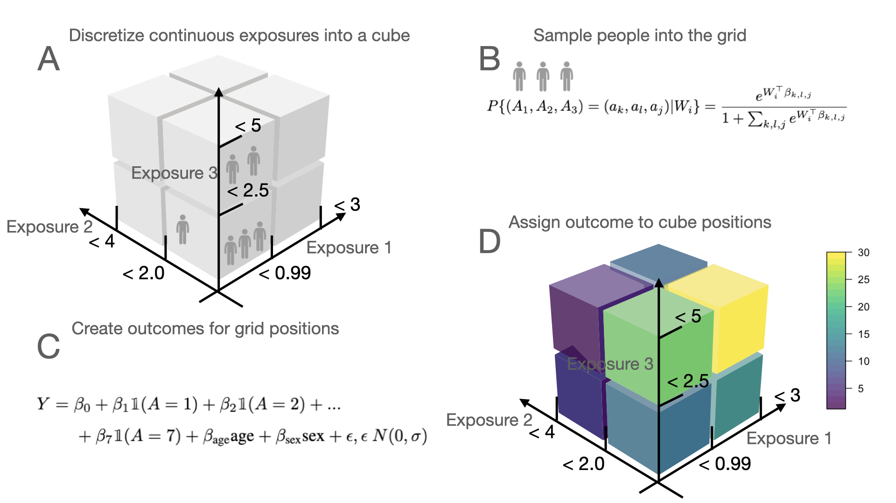
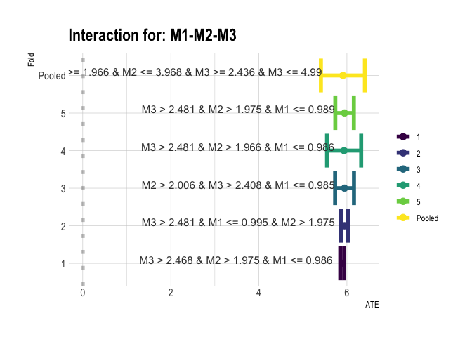

<!-- README.md is generated from README.Rmd. Please edit that file -->

# R/`CVtreeMLE` 


<!-- badges: start -->

[](https://github.com/blind-contours/CVtreeMLE/actions)
[](https://codecov.io/github/blind-contours/CVtreeMLE?branch=master)
[](https://www.r-pkg.org/pkg/CVtreeMLE)
[](https://CRAN.R-project.org/package=CVtreeMLE)
[](https://CRAN.R-project.org/package=CVtreeMLE)
[](https://www.repostatus.org/#active)
[](https://opensource.org/licenses/MIT)
<!-- [](https://doi.org/10.5281/zenodo.4070042) -->
<!-- [](https://doi.org/10.21105/joss.02447) -->
[](https://app.codecov.io/gh/blind-contours/CVtreeMLE?branch=main)
<!-- badges: end -->

> Efficient Estimation of the Causal Effects of Joint Exposure using
> Data Adaptive Decision Trees and Cross-Validated Targeted Maximum
> Likelihood Estimation **Author:** [David
> McCoy](https://davidmccoy.org)

------------------------------------------------------------------------

## What is `CVtreeMLE`?

People often encounter multiple simultaneous exposures (e.g. several
drugs or pollutants). Policymakers are interested in setting safe
limits, interdictions, or recommended dosage combinations based on a
combination of thresholds, one per exposure. Setting these thresholds is
difficult because all relevant interactions between exposures must be
accounted for. Previous statistical methods have used parametric
estimators which don’t directly address the question of superadditive or
subadditive effects in a mixture and rely on unrealistic assumptions.
Here we present an estimator that a) automatically identifies thresholds
that maximize the differential effect of self-selecting exposure within
the thresholded exposure region vs. outside of it; and which b)
unbiasedly and efficiently estimates the magnitude of that differential
effect. This is done by combining a tree-based search algorithm with a
targeted maximum likelihood estimator using cross-validation. We provide
open-source software (CVtreeMLE) that implements the method.

To-date, there is no method which delivers robust statistical inference
based on leaves of a decision tree that also uses the full data.
Although decision trees are widely used algorithms because they provide
interpretable rule-based results, existing methods do not flexibly
adjust for covariates while fitting the tree to a specific set of
exposures. This is of particular interest for environmental
epidemiologists who may be interested in what parts of a pollution
exposure cause adverse health effects or to the medical analyst
interested in finding combinations of drugs which improve patient
outcomes. Current approaches use sample splitting techniques where the
rules found on a training set are applied to a test set to estimate the
conditional mean in each of tree leaves. This type of sample splitting
loses power. Furthermore, existing methods require the decision tree
algorithm to be chosen by the analyst which may not fit the data best,
introducing bias.

A gap exists in statistical estimation where the analyst wants to
understand what exposure levels, as part of a mixture, have the greatest
effect on some outcome while non-parametrically adjusting for baseline
covariates and data-adaptively identifying the best fitting tree applied
to the mixed exposure. This is the goal of `CVtreeMLE`.

The `CVtreeMLE` (Cross-Validated Decision Trees with Targeted Maximum
Likelihood Estimation) R package is designed to provide statistical
software for the construction of efficient estimators from data adaptive
decision trees. The target parameter is the average treatment effect
(ATE) causal parameter defined as the counterfactual mean outcome if all
individuals were jointly exposed to a combination of exposure levels in
a mixed exposure compared to if all individuals were not exposed. Here,
the levels of a joint exposure are data-adaptively identified based on
decision trees applied to a set of exposure variables while flexibly
controlling for covariates non-parametrically. For more information on
data-adaptive parameters see (Hubbard, Kherad-Pajouh, and Van Der Laan
2016).

`CVtreeMLE` uses data-adaptive parameters by implementing V-fold
cross-validation (CV), that is, in 10-fold CV, the data is split 10
times (folds), where 90% of the data is used to determine rules in a
mixture, and the g (probability of being exposed estimator, P(A\|W)) and
Q (outcome estimator E(Y\|A,W)) estimators needed for the ATE. These
rules and estimators created in training data are applied to the
validation data in order to calculate the final ATE target parameter.
This process cycles 10 times and the parameters across the folds are
pooled, utilizing the full data. Because the partition nodes used in the
tree may vary across the folds, we provide a union rule and stability
estimates which informs how variable the rule is across the folds.

In order to optimize the optimum bias-variance trade-off for our causal
parameter of interest we use cross-validated targeted minimum loss based
estimation (CV-TMLE). `CVtreeMLE` builds off of the CV-TMLE general
theorem of cross-validated minimum loss based estimation Zheng and Laan
(2010) which allows the full utilization of loss based super learning to
obtain the initial estimators needed for our target parameter without
risk of overfitting. Thus, `CVtreeMLE` makes possible the non-parametric
estimation of the causal effects of a mixed exposure that both results
in interpretable results which are useful for public policy and are
asymptotically efficient.

`CVtreeMLE` integrates with the
[`sl3`package](https://github.com/tlverse/sl3) (Coyle et al. 2021) to
allow for ensemble machine learning to be leveraged in the estimation
procedure. `sl3` is used to create ensemble machine learning estimators
for the Q and g mechanisms for the average treatment effect (ATE) target
parameter. `sl3` is also used in the iterative backfitting procedure.
The iterative backfitting algorithm fits E(Y\|A,W) = f(A) + h(W), where
f(A) is a Super Learner of decision trees and H(W) is an unrestricted
Super Learner. This semi-parametric additive model allows us to isolate
identification of nodes in A that best explain an outcome while flexibly
adjusting for covariates. In the iterative backfitting procedure, an
ensemble of decision trees are fit on the full mixture modeled together;
the [`pre` package](https://github.com/marjoleinF/pre)(Fokkema 2020) is
used to fit rule ensembles. In backfitting procedure to find thresholds
in each mixture component individually, a Super Learner of decision
trees generated from the [`partykit`
package](http://partykit.r-forge.r-project.org/partykit/)\[partykit2015\]
are created. In each case, the goal is to find the best fitting decision
tree from which we extract decision tree rules, we then calculate the
ATE for these rules.

Below we simulate data for a “mixture cube” and show basic results from
`CVtreeMLE` compared to ground-truth. For more details, please see the
vignette.

------------------------------------------------------------------------

## Installation

*Note:* Because `CVtreeMLE` package (currently) depends on `sl3` that
allows ensemble machine learning to be used for nuisance parameter
estimation and `sl3` is not on CRAN the `CVtreeMLE` package is not
available on CRAN and must be downloaded here.

For the latest features, install the most recent *stable version*  
of `CVtreeMLE`from GitHub via
[`remotes`](https://CRAN.R-project.org/package=remotes):

``` r
remotes::install_github("blind-contours/CVtreeMLE@main")
```

`CVtreeMLE` uses newly added decision tree estimators added to `sl3` so
please download sl3 from:

``` r
remotes::install_github("tlverse/sl3@devel")
```

`CVtreeMLE` also uses the predictive rules ensemble package and the
partykit package for decision trees which the analyst can download via:

``` r
install.packages("partykit")
install.packages("pre")
```

------------------------------------------------------------------------

## Example

First load the package and other packages needed

``` r
library(CVtreeMLE)
library(sl3)
library(pre)
library(partykit)
library(kableExtra)
library(ggplot2)

set.seed(429153)
```

To illustrate how `CVtreeMLE` may be used to ascertain the effect of a
joint exposure, consider three exposures. We show a simulation of these
exposures below. We generate covariates of a population then use a
multinomial regression to assign them to particular combinations of
exposure levels. We then generate outcomes in each region of this
“mixture cube”. One region has the worst outcome and we are interested
to determine if CVtreeMLE identifies this region and estimates the
correct outcome difference in this region compared to the complementary
space.



In reality, the outcome people have will not be homogenous within a
certain region of exposures but we use this example as a way to
illustrate that `CVtreeMLE` is valid and identifies the correct
parameter when we generate data with ground-truth.

## Simulate Data

``` r
sim_data <- simulate_mixture_cube(
  n_obs = 800,
  splits = c(0.99, 2.0, 2.5),
  mins = c(0, 0, 0),
  maxs = c(3, 4, 5),
  subspace_assoc_strength_betas = c(
    0, 0, 0, 0,
    0, 0, 6, 0
  )
)
head(sim_data) %>%
  kbl(caption = "Simulated Data") %>%
  kable_classic(full_width = FALSE, html_font = "Cambria")
```

<table class=" lightable-classic" style="font-family: Cambria; width: auto !important; margin-left: auto; margin-right: auto;">
<caption>
Simulated Data
</caption>
<thead>
<tr>
<th style="text-align:right;">
age
</th>
<th style="text-align:right;">
bmi
</th>
<th style="text-align:right;">
sex
</th>
<th style="text-align:right;">
M1
</th>
<th style="text-align:right;">
M2
</th>
<th style="text-align:right;">
M3
</th>
<th style="text-align:right;">
y
</th>
</tr>
</thead>
<tbody>
<tr>
<td style="text-align:right;">
0.0165143
</td>
<td style="text-align:right;">
-0.4227082
</td>
<td style="text-align:right;">
-1.0221195
</td>
<td style="text-align:right;">
1.7594922
</td>
<td style="text-align:right;">
0.0344271
</td>
<td style="text-align:right;">
2.7936966
</td>
<td style="text-align:right;">
-0.9910446
</td>
</tr>
<tr>
<td style="text-align:right;">
0.1907291
</td>
<td style="text-align:right;">
0.4842019
</td>
<td style="text-align:right;">
0.9771362
</td>
<td style="text-align:right;">
0.1961772
</td>
<td style="text-align:right;">
2.3493205
</td>
<td style="text-align:right;">
1.3962661
</td>
<td style="text-align:right;">
1.1728384
</td>
</tr>
<tr>
<td style="text-align:right;">
-0.1879045
</td>
<td style="text-align:right;">
0.4828171
</td>
<td style="text-align:right;">
-1.0221195
</td>
<td style="text-align:right;">
0.4488381
</td>
<td style="text-align:right;">
0.0433104
</td>
<td style="text-align:right;">
2.6834768
</td>
<td style="text-align:right;">
-1.2116326
</td>
</tr>
<tr>
<td style="text-align:right;">
-0.1959638
</td>
<td style="text-align:right;">
-1.1133632
</td>
<td style="text-align:right;">
-1.0221195
</td>
<td style="text-align:right;">
0.1387679
</td>
<td style="text-align:right;">
2.7877759
</td>
<td style="text-align:right;">
0.6990761
</td>
<td style="text-align:right;">
-1.2167154
</td>
</tr>
<tr>
<td style="text-align:right;">
0.2624385
</td>
<td style="text-align:right;">
0.6081797
</td>
<td style="text-align:right;">
0.9771362
</td>
<td style="text-align:right;">
1.6475103
</td>
<td style="text-align:right;">
1.3305123
</td>
<td style="text-align:right;">
1.6460804
</td>
<td style="text-align:right;">
1.2452379
</td>
</tr>
<tr>
<td style="text-align:right;">
-1.3278240
</td>
<td style="text-align:right;">
-1.0698419
</td>
<td style="text-align:right;">
-1.0221195
</td>
<td style="text-align:right;">
1.4097762
</td>
<td style="text-align:right;">
0.0040681
</td>
<td style="text-align:right;">
2.8495084
</td>
<td style="text-align:right;">
-2.3520191
</td>
</tr>
</tbody>
</table>

Using the `simulate_mixture_cube` we generate 500 observations that are
exposed to three variables with min values being 0 for all and max
values being 3,4, and 5. In each variable we define split points 0.99,
2.0, and 2.5. Given the eight regions in the cube, the
`subspace_assoc_strength_betas` parameter is where we put the outcome in
a specific region.

The indices correspond to an area in the cube:

1.  All mixtures lower than specified thresholds
2.  M1 is higher but M2 and M3 are lower
3.  M2 is higher but M1 and M3 are lower
4.  M1 and M2 are higher and M3 is lower
5.  M3 is higher and M1 and M2 are lower
6.  M1 and M3 are higher and M2 is lower
7.  M2 and M3 are higher and M1 is lower
8.  All mixtures are higher than thresholds

So here - we put 6 at index 7 which means the outcome is 6 when M2 and
M3 are higher and M1 is lower than their respective split points. The
outcome is 0 in all other regions.

## Run `CVtreeMLE`

We will now pass the simulated data and variable names for each node in
O = W,A,Y to the `CVtreeMLE` function.

``` r
ptm <- proc.time()

sim_results <- CVtreeMLE(
  data = sim_data,
  w = c("age", "sex", "bmi"),
  a = c(paste("M", seq(3), sep = "")),
  y = "y",
  n_folds = 5,
  parallel_cv = TRUE,
  seed = 2333,
  parallel_type = "multi_session",
  family = "continuous",
  num_cores = 2
)

proc.time() - ptm
#>    user  system elapsed 
#>  54.595   7.885 624.751
```

Note that above, there are default estimators for all parameters if they
are not passed to the function. Here we just use the out of the box
estimators that are defined in `utils_create_sls.R`. These estimators
are chosen to be both non-parametric but also not too computationally
demanding. Examples of estimators used by default are random forest,
xgboost, elastic net, and glms. Users can also pass in their own custom
stacks of learners. We also see here that, using 2 cores with these
learners on our simulated data with 500 observations and 6 variables,
our run time is 21 minutes. This can be greatly improved by increasing
the num_cores parameter.

## Results

We can look at the pooled TMLE results for this model. Let’s see if
`CVtreeMLE` identified the current rule in all our folds:

``` r
mixture_results <- sim_results$`Pooled TMLE Mixture Results`
mixture_results %>%
  dplyr::filter(Proportion_Folds == 1.0) %>%
  kbl(caption = "Mixture Results") %>%
  kable_classic(full_width = FALSE, html_font = "Cambria")
```

<table class=" lightable-classic" style="font-family: Cambria; width: auto !important; margin-left: auto; margin-right: auto;">
<caption>
Mixture Results
</caption>
<thead>
<tr>
<th style="text-align:right;">
Mixture ATE
</th>
<th style="text-align:right;">
Standard Error
</th>
<th style="text-align:right;">
Lower CI
</th>
<th style="text-align:right;">
Upper CI
</th>
<th style="text-align:right;">
P-value
</th>
<th style="text-align:right;">
P-value Adj
</th>
<th style="text-align:left;">
Vars
</th>
<th style="text-align:right;">
RMSE
</th>
<th style="text-align:left;">
Union_Rule
</th>
<th style="text-align:right;">
Proportion_Folds
</th>
</tr>
</thead>
<tbody>
<tr>
<td style="text-align:right;">
3.206
</td>
<td style="text-align:right;">
0.158
</td>
<td style="text-align:right;">
2.896
</td>
<td style="text-align:right;">
3.516
</td>
<td style="text-align:right;">
0
</td>
<td style="text-align:right;">
0
</td>
<td style="text-align:left;">
M1-M2
</td>
<td style="text-align:right;">
2.136
</td>
<td style="text-align:left;">
M1 \>= 0.002 & M1 \<= 0.966 & M2 \>= 1.336 & M2 \<= 3.968
</td>
<td style="text-align:right;">
1
</td>
</tr>
<tr>
<td style="text-align:right;">
5.933
</td>
<td style="text-align:right;">
0.050
</td>
<td style="text-align:right;">
5.836
</td>
<td style="text-align:right;">
6.031
</td>
<td style="text-align:right;">
0
</td>
<td style="text-align:right;">
0
</td>
<td style="text-align:left;">
M1-M2-M3
</td>
<td style="text-align:right;">
1.061
</td>
<td style="text-align:left;">
M1 \>= 0.002 & M1 \<= 0.989 & M2 \>= 1.966 & M2 \<= 3.968 & M3 \>= 2.436
& M3 \<= 4.99
</td>
<td style="text-align:right;">
1
</td>
</tr>
</tbody>
</table>

Above, the estimated mixture ATE for this rule is 5.93 (5.84 - 6.03),
which covers our true mixture ATE used to generate the data which was 6.
The estimated mixture ATE is interpreted as: the average counterfactual
mean outcome if all individuals were exposed to the rule shown in
`Union Rule` compared to if all individuals were unexposed is 5.93. That
is, those individuals who are exposed to this rule have an outcome that
is 5.93 higher compared to those that are not exposed to this rule. The
standard error, confidence intervals and p-values are derived from the
influence curve of this estimator.

We can also look at the v-fold specific results. This gives the analyst
the ability to investigate how stable the estimates and rules are. These
results are the same as standard sample splitting techniques and
therefore have proper variance estimates and p-values. Below we show the
v-fold specific interactions found with fold specific estimates of our
ATE target parameter and variance estimates from the fold specific IC.

``` r
mixture_v_results <- sim_results$`V-Specific Mix Results`
mixture_v_results$`M1-M2-M3`
#>     ate    se lower_ci upper_ci p_val p_val_adj  rmse
#> 1 5.894 0.023   5.8490   5.9380     0         0 1.198
#> 2 5.946 0.043   5.8610   6.0300     0         0 0.997
#> 3 5.946 0.109   5.7320   6.1600     0         0 1.178
#> 4 5.936 0.198   5.5480   6.3240     0         0 1.277
#> 5 5.946 0.107   5.7360   6.1570     0         0 1.120
#> 6 5.909 0.255   5.4091   6.4079     0         0 1.154
#>                                                                           mix_rule
#> 1                                            M3 > 2.468 & M2 > 1.975 & M1 <= 0.986
#> 2                                            M3 > 2.481 & M1 <= 0.995 & M2 > 1.975
#> 3                                            M2 > 2.006 & M3 > 2.408 & M1 <= 0.985
#> 4                                            M3 > 2.481 & M2 > 1.966 & M1 <= 0.986
#> 5                                            M3 > 2.481 & M2 > 1.975 & M1 <= 0.989
#> 6 M1 >= 0.002 & M1 <= 0.989 & M2 >= 1.966 & M2 <= 3.968 & M3 >= 2.436 & M3 <= 4.99
#>     fold variables
#> 1      1  M1-M2-M3
#> 2      2  M1-M2-M3
#> 3      3  M1-M2-M3
#> 4      4  M1-M2-M3
#> 5      5  M1-M2-M3
#> 6 Pooled  M1-M2-M3
```

In v-fold specific results we also give a pooled estimate. This is
different than the pooled TMLE estimate. Here we simply take the
weighted average of the fold specific ATEs and the harmonic mean of the
variances. This is similar to meta-analysis approaches.

We can plot our v-fold mixture results findings using the
`plot_mixture_results` function. This will return a list of plots with
names corresponding to the interactions found.

``` r
mixture_plots <- plot_mixture_results(
  v_intxn_results =
    sim_results$`V-Specific Mix Results`,
  hjust = 1.05
)
mixture_plots$`M1-M2-M3`
```

<!-- --> This plot
shows the ATE specific for each fold and for the weighted-mean results
over the fold with corresponding pooled variance. The rule is the union
rule which includes all observations that were indicated by the fold
specific rules.

`CVtreeMLE` also data-adaptively identifies thresholds in the marginal
space. This feature is described in the vignette. In the marginal
setting, partitions are found for each mixture variable individually and
the ATE is in reference to the baseline (lowest leaf) value.

Additional details for this and other features are given in the
vignette.

------------------------------------------------------------------------

## Issues

If you encounter any bugs or have any specific feature requests, please
[file an issue](https://github.com/blind-contours/CVtreeMLE/issues).
Further details on filing issues are provided in our [contribution
guidelines](https://github.com/blind-contours/CVtreeMLE/blob/main/contributing.md).

------------------------------------------------------------------------

## Contributions

Contributions are very welcome. Interested contributors should consult
our [contribution
guidelines](https://github.com/blind-contours/CVtreeMLE/blob/main/contributing.md)
prior to submitting a pull request.


------------------------------------------------------------------------

## Related

- [R/`sl3`](https://github.com/tlverse/sl3) - An R package providing
  implementation for Super Learner ensemble machine learning algorithms.

- [R/`pre`](https://github.com/marjoleinF/pre) - An R package package
  for deriving prediction rule ensembles for binary, multinomial,
  (multivariate) continuous, count and survival responses.

- [R/`partykit`](http://partykit.r-forge.r-project.org/partykit/) - A
  toolkit with infrastructure for representing, summarizing, and
  visualizing tree-structured regression and classification models. This
  unified infrastructure can be used for reading/coercing tree models
  from different sources (‘rpart’, ‘RWeka’, ‘PMML’) yielding objects
  that share functionality for print()/plot()/predict() methods.

- [R/`SuperLearner`](https://github.com/ecpolley/SuperLearner) - Legacy
  R package providing implementation for Super Learner ensemble machine
  learning algorithms.

------------------------------------------------------------------------

## Funding

The development of this software was supported in part through grants
from the NIH-funded Biomedical Big Data Training Program at UC Berkeley
where I was a biomedical big data fellow.

------------------------------------------------------------------------

## License

© 2017-2022 David B. McCoy

The contents of this repository are distributed under the MIT license.
See below for details:

    MIT License
    Copyright (c) 2017-2022 David B. McCoy
    Permission is hereby granted, free of charge, to any person obtaining a copy
    of this software and associated documentation files (the "Software"), to deal
    in the Software without restriction, including without limitation the rights
    to use, copy, modify, merge, publish, distribute, sublicense, and/or sell
    copies of the Software, and to permit persons to whom the Software is
    furnished to do so, subject to the following conditions:
    The above copyright notice and this permission notice shall be included in all
    copies or substantial portions of the Software.
    THE SOFTWARE IS PROVIDED "AS IS", WITHOUT WARRANTY OF ANY KIND, EXPRESS OR
    IMPLIED, INCLUDING BUT NOT LIMITED TO THE WARRANTIES OF MERCHANTABILITY,
    FITNESS FOR A PARTICULAR PURPOSE AND NONINFRINGEMENT. IN NO EVENT SHALL THE
    AUTHORS OR COPYRIGHT HOLDERS BE LIABLE FOR ANY CLAIM, DAMAGES OR OTHER
    LIABILITY, WHETHER IN AN ACTION OF CONTRACT, TORT OR OTHERWISE, ARISING FROM,
    OUT OF OR IN CONNECTION WITH THE SOFTWARE OR THE USE OR OTHER DEALINGS IN THE
    SOFTWARE.

------------------------------------------------------------------------

## References

<div id="refs" class="references csl-bib-body hanging-indent">

<div id="ref-coyle2021sl3" class="csl-entry">

Coyle, Jeremy R, Nima S Hejazi, Ivana Malenica, Rachael V Phillips, and
Oleg Sofrygin. 2021. *<span class="nocase">sl3</span>: Modern Pipelines
for Machine Learning and Super Learning*.
<https://doi.org/10.5281/zenodo.1342293>.

</div>

<div id="ref-Fokkema2020a" class="csl-entry">

Fokkema, Marjolein. 2020. “<span class="nocase">Fitting prediction rule
ensembles with R package pre</span>.” *Journal of Statistical Software*
92 (12). <https://doi.org/10.18637/jss.v092.i12>.

</div>

<div id="ref-Hubbard2016" class="csl-entry">

Hubbard, Alan E., Sara Kherad-Pajouh, and Mark J. Van Der Laan. 2016.
“<span class="nocase">Statistical Inference for Data Adaptive Target
Parameters</span>.” *International Journal of Biostatistics* 12 (1):
3–19. <https://doi.org/10.1515/ijb-2015-0013>.

</div>

<div id="ref-Zheng2010" class="csl-entry">

Zheng, Wenjing, and MJ van der Laan. 2010. “<span
class="nocase">Asymptotic theory for cross-validated targeted maximum
likelihood estimation</span>.” *U.C. Berkeley Division of Biostatistics
Working Paper Series*, no. 273.
<http://biostats.bepress.com/ucbbiostat/paper273/>.

</div>

</div>
