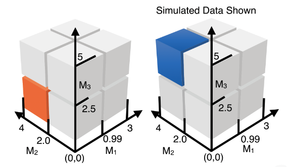

<!-- README.md is generated from README.Rmd. Please edit that file -->

# CVtreeMLE 


<!-- badges: start -->

[](https://github.com/blind-contours/CVtreeMLE/actions)
[](https://codecov.io/github/blind-contours/CVtreeMLE?branch=master)
[](https://www.r-pkg.org/pkg/CVtreeMLE)
[](https://CRAN.R-project.org/package=CVtreeMLE)
[](https://CRAN.R-project.org/package=CVtreeMLE)
[](https://www.repostatus.org/#active)
[](https://opensource.org/licenses/MIT)
[](https://doi.org/10.5281/zenodo.4070042)
[](https://doi.org/10.21105/joss.02447)
<!-- badges: end -->

> Efficient Estimation of the Causal Effects of Joint Exposure using
> Data Adaptive Decision Trees and Cross-Validated Targeted Maximum
> Likelihood Estimation **Authors:** [David
> McCoy](https://davidmccoy.org)

------------------------------------------------------------------------

## What is `CVtreeMLE`?

The `CVtreeMLE` (Cross-Validated Decision Trees with Targeted Maximum
Likelihood Estmation) R package is designed to provide facilities for
the construction of efficient estimators of an average treatment effect
(ATE) causal parameter defined as the counterfactual mean of an outcome
if all individuals were jointly exposed to a combination of exposure
levels in a mixed exposure compared to if all individuals were not
exposed. Here, a joint exposure is data-adaptively defined based on
decision trees applied to a set of exposure variables while flexibly
controlling for covariates non-parametrically. For more information on
data- adaptive parameters see (Dı́az and van der Laan 2012). In each
V-fold during cross- validation, `CVtreeMLE`:

1.  Performs an iterative backfitting of a Super Learner for Y\|W, the
    expected outcome given covariates, and Y\|A, the expected outcome
    given the mixture variables. Consider the estimator for Y\|W as h(x)
    and the estimator for Y\|A as g(x). After initialization, h(x) is
    fit with an offset for predictions from g(x). Likewise, g(x) is fit
    offset with predictions from h(x). This procedure iterates until
    convergence, or when there is no change in fit between either
    estimator.

2.  The same iterative backfitting is conducted but for Y\|M\_i and
    Y\|W,M\_ne\_i - or rather, iteratively backfitting decision trees to
    each mixture variable individually while controlling for covariates
    and other mixture variables in the complementary non-parametric
    Super Learner.

3.  If decision trees are found for the mixture measured as an
    interaction and/or any marginal mixture component which explain the
    outcome while flexibly controlling for covariates, the binary
    indicators are created which indicate observations that meet the
    respective rule(s) in the tree.

4.  For each decision tree, the propensity score is estimated (the
    probability of being exposed to the respective levels of the
    exposure(s)), or the g mechanism. Similarly, the Q mechanism, or the
    outcome estimator is created which estimates the expected outcome
    given exposure to the rule and covariates.

5.  Once these nuisance parameters are estimated, a pooled targeted
    maximum likelihood estimation is done to estimate the average
    treatment effect for the data-adaptively identified exposures
    (thresholds). This average treatment effect is our target parameter
    and is pooled over the validation data in each V-fold.

6.  Tables are given which include the ATE for each variable or sets of
    variables found across all the folds alongside variance estimates
    from the efficient influence curve. Average rules are created which
    are made from observations that meet each fold-specific rule.

`CVtreeMLE` integrates with the [`sl3`
package](https://github.com/tlverse/sl3) (**coyle2020sl3?**) to allow
for ensemble machine learning to be leveraged in the estimation
procedure. `sl3` is used in the iterative backfitting procedure because
this step requires ensemble machine learning with an offset for the
decision tree predictions. In the Q and g mechanisms, `CVtreeMLE` uses
the legacy [`Super Learner`
package](https://github.com/tlverse/SuperLearner) (**coyle2020sl3?**).
In the iterative backfitting procedure, for decision tree fitting on the
full mixture modeled together, the \[`pre` package(PRE PACKAGE
HERE)[citation](#citation) is used to fit rule ensembles. In backfitting
procedure to find thresholds in each mixture component individually, the
[`partykit` package](PARTYKIT%20PACKAGE%20HERE)[citation](#citation). In
both instances, trees can be estimated with an offset from ensemble
machine learning predictions.

For many practical applications (e.g., vaccine efficacy trials),
observed data is often subject to a two-phase sampling mechanism (i.e.,
through the use of a two-stage design). In such cases, efficient
estimators (of both varieties) must be augmented to construct unbiased
estimates of the population-level causal parameter. Rose and van der
Laan (2011) first introduced an augmentation procedure that relies on
introducing inverse probability of censoring (IPC) weights directly to
an appropriate loss function or to the efficient influence function
estimating equation. `CVtreeMLE` extends this approach to compute
IPC-weighted one-step and TML estimators of the counterfactual mean
outcome under a shift stochastic treatment regime. The package is
designed to implement the statistical methodology described in Hejazi et
al. (2020) and extensions thereof.

------------------------------------------------------------------------

## Installation

For standard use, we recommend installing the package from
[CRAN](https://CRAN.R-project.org/package=CVtreeMLE) via

``` r
install.packages("CVtreeMLE")
```

*Note:* If `CVtreeMLE` is installed from
[CRAN](https://CRAN.R-project.org/package=CVtreeMLE), the `sl3`, an
enhancing dependency that allows ensemble machine learning to be used
for nuisance parameter estimation, won’t be included. We highly
recommend additionally installing `sl3` from GitHub via
[`remotes`](https://CRAN.R-project.org/package=remotes):

``` r
remotes::install_github("tlverse/sl3@master")
```

For the latest features, install the most recent *stable version* of
`CVtreeMLE` from GitHub via
[`remotes`](https://CRAN.R-project.org/package=remotes):

``` r
remotes::install_github("blind-contours/CVtreeMLE@master")
```

To contribute, install the *development version* of `CVtreeMLE` from
GitHub via [`remotes`](https://CRAN.R-project.org/package=remotes):

``` r
remotes::install_github("blind-contours/CVtreeMLE@devel")
```

------------------------------------------------------------------------

## Example

To illustrate how `CVtreeMLE` may be used to ascertain the effect of a
joint exposure, consider the following example:

First load the package and other packages needed

``` r
library(CVtreeMLE)
library(sl3)
library(kableExtra)
library(ggplot2)
library(jtools)


set.seed(429153)
```

Use the `simulate_mixture_cube` function to generate simulated data that
represents ground-truth. Here, we create three continuous mixture
variables, *A*, that are correlated and baseline covariates, *W*, that
are potential confounders. Our outcome will be generated such that
individuals with a specific set of exposures have a different outcome
compared to individuals who are not exposed to this combination of
exposure levels.

 The above figure illustrates the data we will
generate using this function. Here, individuals exposed to
*M*<sub>1</sub> at values less than 1.0, *M*<sub>2</sub> at levels more
than 2.0, and *M*<sub>3</sub> at levels at or greater than 2.5 have an
outcome of 6, compared to individuals not exposed to this combination of
thresholds who have an expected outcome of 0 - thus our ATE is 6. Two
covariates *W* confound this relationship. Let’s simulate this scenario.

``` r
n_obs <- 500 # number of observations we want to simulate
splits <- c(0.99, 2.0, 2.5) # split points for each mixture
mins <- c(0, 0, 0) # minimum values for each mixture
maxs <- c(3, 4, 5) # maximum value for each mixture
mu <- c(0, 0, 0) # mu for each mixture
sigma <- matrix(c(1, 0.5, 0.8, 0.5, 1, 0.7, 0.8, 0.7, 1), nrow = 3, ncol = 3) # variance/covariance of mixture variables
w1_betas <- c(0.0, 0.01, 0.03, 0.06, 0.1, 0.05, 0.2, 0.04) # subspace probability relationship with covariate W1
w2_betas <- c(0.0, 0.04, 0.01, 0.07, 0.15, 0.1, 0.1, 0.04) # subspace probability relationship with covariate W2
mix_subspace_betas <- c(0.00, 0.08, 0.05, 0.01, 0.05, 0.033, 0.07, 0.09) # probability of mixture subspace (for multinomial outcome generation)
subspace_assoc_strength_betas <- c(0, 0, 0, 0, 0, 0, 6, 0) # mixture subspace impact on outcome Y, here the subspace where M1 is lower and M2 and M3 are higher based on values in splits
marginal_impact_betas <- c(0, 0, 0) # marginal impact of mixture component on Y
eps_sd <- 0.01 # random error
binary <- FALSE # if outcome is binary
```

``` r
sim_data <- simulate_mixture_cube(
  n_obs = n_obs, 
  splits = splits,
  mins = mins,
  maxs = maxs,
  mu = mu,
  sigma = sigma,
  w1_betas = w1_betas,
  w2_betas = w2_betas,
  mix_subspace_betas = mix_subspace_betas,
  subspace_assoc_strength_betas = subspace_assoc_strength_betas,
  marginal_impact_betas = marginal_impact_betas,
  eps_sd = eps_sd,
  binary = binary
)

head(sim_data) %>%
  kbl(caption = "Simulated Data") %>%
  kable_classic(full_width = F, html_font = "Cambria")
```

<table class=" lightable-classic" style="font-family: Cambria; width: auto !important; margin-left: auto; margin-right: auto;">
<caption>
Simulated Data
</caption>
<thead>
<tr>
<th style="text-align:right;">
W
</th>
<th style="text-align:right;">
W2
</th>
<th style="text-align:right;">
M1
</th>
<th style="text-align:right;">
M2
</th>
<th style="text-align:right;">
M3
</th>
<th style="text-align:right;">
y
</th>
</tr>
</thead>
<tbody>
<tr>
<td style="text-align:right;">
0.3125971
</td>
<td style="text-align:right;">
0.0281233
</td>
<td style="text-align:right;">
0.0918698
</td>
<td style="text-align:right;">
2.1287872
</td>
<td style="text-align:right;">
0.5587179
</td>
<td style="text-align:right;">
0.3523733
</td>
</tr>
<tr>
<td style="text-align:right;">
0.4677867
</td>
<td style="text-align:right;">
0.1344452
</td>
<td style="text-align:right;">
2.2546606
</td>
<td style="text-align:right;">
0.0433708
</td>
<td style="text-align:right;">
1.2521522
</td>
<td style="text-align:right;">
0.6081815
</td>
</tr>
<tr>
<td style="text-align:right;">
-0.7798901
</td>
<td style="text-align:right;">
-0.5718299
</td>
<td style="text-align:right;">
0.1683829
</td>
<td style="text-align:right;">
2.3168107
</td>
<td style="text-align:right;">
0.1473310
</td>
<td style="text-align:right;">
-1.3717913
</td>
</tr>
<tr>
<td style="text-align:right;">
-0.0760508
</td>
<td style="text-align:right;">
-0.6356721
</td>
<td style="text-align:right;">
1.3832386
</td>
<td style="text-align:right;">
0.9429022
</td>
<td style="text-align:right;">
2.9218706
</td>
<td style="text-align:right;">
-0.7252087
</td>
</tr>
<tr>
<td style="text-align:right;">
-0.1238976
</td>
<td style="text-align:right;">
-0.3105393
</td>
<td style="text-align:right;">
0.4341428
</td>
<td style="text-align:right;">
3.0653637
</td>
<td style="text-align:right;">
1.6723064
</td>
<td style="text-align:right;">
-0.4330232
</td>
</tr>
<tr>
<td style="text-align:right;">
0.2149969
</td>
<td style="text-align:right;">
0.1632984
</td>
<td style="text-align:right;">
1.0384095
</td>
<td style="text-align:right;">
2.2392699
</td>
<td style="text-align:right;">
0.1746694
</td>
<td style="text-align:right;">
0.3813563
</td>
</tr>
</tbody>
</table>

Here, we set up our Super Learner using `SL3` for the iterative
backfitting procedure. These learners will fit *Y*\|*W* offset by
*Y*\|*A* as we fit decision trees to the exposure variables both jointly
and individially.

``` r
lrnr_glm <- Lrnr_glm$new()
lrnr_bayesglm <- Lrnr_bayesglm$new()
lrnr_gam <- Lrnr_gam$new()
lrnr_lasso <- Lrnr_glmnet$new(alpha = 1)
lrnr_earth <- Lrnr_earth$new()
lrnr_ranger <- Lrnr_ranger$new()
lrnr_xgboost100 <- Lrnr_xgboost$new(nrounds = 100, early_stopping_rounds = 10)
lrnr_xgboost50 <- Lrnr_xgboost$new(nrounds = 50, early_stopping_rounds = 5)
lrnr_xgboost20 <- Lrnr_xgboost$new(nrounds = 20)
# put all the learners together (this is just one way to do it)
learners <- c(lrnr_glm, lrnr_bayesglm,
lrnr_gam, lrnr_ranger,
lrnr_xgboost100, lrnr_xgboost50, lrnr_xgboost20)

Q1_stack <- make_learner(Stack, learners)
```

This second stack of learners will be used in our Q and g mechanisms
after we identify rules using the first stack.

``` r
SL.library<- c('SL.randomForest',
               'SL.earth',
               "SL.glm",
               "SL.mean")
```

We will now pass the simulated data, learners, and variable names for
each node in *O* = *W*, *A*, *Y* to the `CVtreeMLE` function:

``` r
sim_results <- CVtreeMLE(data = sim_data,
                                   W = c("W", "W2"),
                                   Y = "y",
                                   A = c(paste("M", seq(3), sep = "")),
                                   back_iter_SL = Q1_stack,
                                   SL.library = SL.library,
                                   n_folds = 2,
                                   family = "gaussian",
                                   H.AW_trunc_lvl = 10,
                                   parallel = TRUE,
                                   verbose = FALSE)
#> Warning in qlogis(QbarAW): NaNs produced
#> Warning in qlogis(bound_precision(QbarAW)): NaNs produced
#> Warning in qlogis(bound_precision(Qbar1W)): NaNs produced
#> Warning in qlogis(bound_precision(Qbar0W)): NaNs produced
#> Warning in qlogis(QbarAW_additive): NaNs produced
#> Warning in stats::qlogis(bound_precision(mix_additive_data$QbarAW_additive)):
#> NaNs produced
```

Let’s look at the marginal results first. These are the rules found for
each individual variable in the vector of exposures while controlling
for other exposures and covariates.

``` r
marginal_results <- sim_results$`Marginal Results`
head(marginal_results) %>%
  kbl(caption = "Marginal Results") %>%
  kable_classic(full_width = F, html_font = "Cambria")
```

<table class=" lightable-classic" style="font-family: Cambria; width: auto !important; margin-left: auto; margin-right: auto;">
<caption>
Marginal Results
</caption>
<thead>
<tr>
<th style="text-align:left;">
</th>
<th style="text-align:right;">
Marginal ATE
</th>
<th style="text-align:right;">
Standard Error
</th>
<th style="text-align:right;">
Lower CI
</th>
<th style="text-align:right;">
Upper CI
</th>
<th style="text-align:right;">
P-value
</th>
<th style="text-align:right;">
P-value Adj
</th>
<th style="text-align:left;">
Marginal Rules
</th>
<th style="text-align:right;">
Fraction Overlap
</th>
<th style="text-align:right;">
Min
</th>
<th style="text-align:right;">
Max
</th>
</tr>
</thead>
<tbody>
<tr>
<td style="text-align:left;">
M1
</td>
<td style="text-align:right;">
1.3775659
</td>
<td style="text-align:right;">
0.1865153
</td>
<td style="text-align:right;">
1.0120025
</td>
<td style="text-align:right;">
1.743129
</td>
<td style="text-align:right;">
0.00e+00
</td>
<td style="text-align:right;">
0.00e+00
</td>
<td style="text-align:left;">
M1 &gt; 0.00859 & M1 &lt; 0.69216
</td>
<td style="text-align:right;">
0.7945205
</td>
<td style="text-align:right;">
0.0011497
</td>
<td style="text-align:right;">
2.988107
</td>
</tr>
<tr>
<td style="text-align:left;">
M2
</td>
<td style="text-align:right;">
1.2091433
</td>
<td style="text-align:right;">
0.2215554
</td>
<td style="text-align:right;">
0.7749027
</td>
<td style="text-align:right;">
1.643384
</td>
<td style="text-align:right;">
0.00e+00
</td>
<td style="text-align:right;">
1.00e-07
</td>
<td style="text-align:left;">
M2 &gt; 2.9311 & M2 &lt; 3.99468
</td>
<td style="text-align:right;">
0.5141700
</td>
<td style="text-align:right;">
0.0002522
</td>
<td style="text-align:right;">
3.994680
</td>
</tr>
<tr>
<td style="text-align:left;">
M3
</td>
<td style="text-align:right;">
0.9942746
</td>
<td style="text-align:right;">
0.2267847
</td>
<td style="text-align:right;">
0.5497847
</td>
<td style="text-align:right;">
1.438765
</td>
<td style="text-align:right;">
1.16e-05
</td>
<td style="text-align:right;">
3.49e-05
</td>
<td style="text-align:left;">
M3 &gt; 3.75935 & M3 &lt; 4.98025
</td>
<td style="text-align:right;">
0.5364807
</td>
<td style="text-align:right;">
0.0028738
</td>
<td style="text-align:right;">
4.980251
</td>
</tr>
</tbody>
</table>

``` r
mixture_results <- sim_results$`Mixture Results`
head(mixture_results) %>%
  kbl(caption = "Mixture Results") %>%
  kable_classic(full_width = F, html_font = "Cambria")
```

<table class=" lightable-classic" style="font-family: Cambria; width: auto !important; margin-left: auto; margin-right: auto;">
<caption>
Mixture Results
</caption>
<thead>
<tr>
<th style="text-align:right;">
Mixture ATE
</th>
<th style="text-align:right;">
Standard Error
</th>
<th style="text-align:right;">
Lower CI
</th>
<th style="text-align:right;">
Upper CI
</th>
<th style="text-align:right;">
P-value
</th>
<th style="text-align:right;">
P-value Adj
</th>
<th style="text-align:left;">
vars
</th>
<th style="text-align:left;">
Mixture Interaction Rules
</th>
<th style="text-align:right;">
Fraction Covered
</th>
</tr>
</thead>
<tbody>
<tr>
<td style="text-align:right;">
5.999859
</td>
<td style="text-align:right;">
0.0198432
</td>
<td style="text-align:right;">
5.960967
</td>
<td style="text-align:right;">
6.038751
</td>
<td style="text-align:right;">
0
</td>
<td style="text-align:right;">
0
</td>
<td style="text-align:left;">
M1M2M3
</td>
<td style="text-align:left;">
M1 &gt; 0.021 & M1 &lt; 0.934 & M2 &gt; 2.034 & M2 &lt; 3.994 & M3 &gt;
2.534 & M3 &lt; 4.98
</td>
<td style="text-align:right;">
0.9666667
</td>
</tr>
</tbody>
</table>

Across the folds, the expected outcome given the cumulative sum of
marginal exposures is also estimated. That is, answering a question such
as “What is the exposure specific mean for each additional exposure
level.”

``` r
effect_plot(sim_results$`Additive MSM`, 
            pred = sum_marg_hits, 
            interval = TRUE, 
            y.label = "Expected Outcome",
            x.label = "Cumulative Exposure",
            cat.geom = "line",
            colors = "black")
```

<!-- -->

In the plot above, we see the expected outcome given exposure to none of
the rules found for each individual variable, exposure to any 1 rule for
*M*<sub>1</sub>, *M*<sub>2</sub> or *M*<sub>3</sub>, any two or all
three.

------------------------------------------------------------------------

## Issues

If you encounter any bugs or have any specific feature requests, please
[file an issue](https://github.com/blind-contours/CVtreeMLE/issues).
Further details on filing issues are provided in our [contribution
guidelines](https://github.com/blind-contours/CVtreeMLE/blob/master/CONTRIBUTING.md).

------------------------------------------------------------------------

## Contributions

Contributions are very welcome. Interested contributors should consult
our [contribution
guidelines](https://github.com/blind-contours/CVtreeMLE/blob/master/CONTRIBUTING.md)
prior to submitting a pull request.

------------------------------------------------------------------------

## Citation

After using the `CVtreeMLE` R package, please cite the following:

        @article{hejazi2020efficient,
          author = {Hejazi, Nima S and {van der Laan}, Mark J and Janes, Holly
            E and Gilbert, Peter B and Benkeser, David C},
          title = {Efficient nonparametric inference on the effects of
            stochastic interventions under two-phase sampling, with
            applications to vaccine efficacy trials},
          year = {2020},
          doi = {10.1111/biom.13375},
          url = {https://doi.org/10.1111/biom.13375},
          journal = {Biometrics},
          publisher = {Wiley Online Library}
        }

        @article{hejazi2020CVtreeMLE-joss,
          author = {Hejazi, Nima S and Benkeser, David C},
          title = {{CVtreeMLE}: Efficient estimation of the causal effects of
            stochastic interventions in {R}},
          year  = {2020},
          doi = {10.21105/joss.02447},
          url = {https://doi.org/10.21105/joss.02447},
          journal = {Journal of Open Source Software},
          publisher = {The Open Journal}
        }

        @software{hejazi2020CVtreeMLE-rpkg,
          author = {Hejazi, Nima S and Benkeser, David C},
          title = {{CVtreeMLE}: Efficient Estimation of the Causal Effects of
            Stochastic Interventions},
          year  = {2020},
          doi = {10.5281/zenodo.4070042},
          url = {https://CRAN.R-project.org/package=CVtreeMLE},
          note = {R package version 0.3.4}
        }

------------------------------------------------------------------------

## Related

-   [R/`tmle3shift`](https://github.com/tlverse/tmle3shift) - An R
    package providing an independent implementation of the same core
    routines for the TML estimation procedure and statistical
    methodology as is made available here, through reliance on a unified
    interface for Targeted Learning provided by the
    [`tmle3`](https://github.com/tlverse/tmle3) engine of the [`tlverse`
    ecosystem](https://github.com/tlverse).

-   [R/`medshift`](https://github.com/blind-contours/medshift) - An R
    package providing facilities to estimate the causal effect of
    stochastic treatment regimes in the mediation setting, including
    classical (IPW) and augmented double robust (one-step) estimators.
    This is an implementation of the methodology explored by Dı́az and
    Hejazi (2020).

-   [R/`haldensify`](https://github.com/blind-contours/haldensify) - A
    minimal package for estimating the conditional density treatment
    mechanism component of this parameter based on using the [highly
    adaptive lasso](https://github.com/tlverse/hal9001)
    (**coyle2020hal9001-rpkg?**; Hejazi, Coyle, and van der Laan 2020)
    in combination with a pooled hazard regression. This package
    implements a variant of the approach advocated by Dı́az and van der
    Laan (2011).

------------------------------------------------------------------------

## Funding

The development of this software was supported in part through grants
from the National Library of Medicine (award number [T32
LM012417](https://reporter.nih.gov/project-details/9248418)) and the
National Institute of Allergy and Infectious Diseases (award number [R01
AI074345](https://reporter.nih.gov/project-details/9926564)) of the
National Institutess of Health.

------------------------------------------------------------------------

## License

© 2017-2021 [David B. McCoy](https://davidmccoy.org)

The contents of this repository are distributed under the MIT license.
See below for details:

    MIT License
    Copyright (c) 2017-2021 David B. McCoy
    Permission is hereby granted, free of charge, to any person obtaining a copy
    of this software and associated documentation files (the "Software"), to deal
    in the Software without restriction, including without limitation the rights
    to use, copy, modify, merge, publish, distribute, sublicense, and/or sell
    copies of the Software, and to permit persons to whom the Software is
    furnished to do so, subject to the following conditions:
    The above copyright notice and this permission notice shall be included in all
    copies or substantial portions of the Software.
    THE SOFTWARE IS PROVIDED "AS IS", WITHOUT WARRANTY OF ANY KIND, EXPRESS OR
    IMPLIED, INCLUDING BUT NOT LIMITED TO THE WARRANTIES OF MERCHANTABILITY,
    FITNESS FOR A PARTICULAR PURPOSE AND NONINFRINGEMENT. IN NO EVENT SHALL THE
    AUTHORS OR COPYRIGHT HOLDERS BE LIABLE FOR ANY CLAIM, DAMAGES OR OTHER
    LIABILITY, WHETHER IN AN ACTION OF CONTRACT, TORT OR OTHERWISE, ARISING FROM,
    OUT OF OR IN CONNECTION WITH THE SOFTWARE OR THE USE OR OTHER DEALINGS IN THE
    SOFTWARE.

------------------------------------------------------------------------

## References

<div id="refs" class="references csl-bib-body hanging-indent">

<div id="ref-diaz2020causal" class="csl-entry">

Dı́az, Iván, and Nima S Hejazi. 2020. “Causal Mediation Analysis for
Stochastic Interventions.” *Journal of the Royal Statistical Society:
Series B (Statistical Methodology)* 82 (3): 661–83.
<https://doi.org/10.1111/rssb.12362>.

</div>

<div id="ref-diaz2011super" class="csl-entry">

Dı́az, Iván, and Mark J van der Laan. 2011. “Super Learner Based
Conditional Density Estimation with Application to Marginal Structural
Models.” *The International Journal of Biostatistics* 7 (1): 1–20.

</div>

<div id="ref-diaz2012population" class="csl-entry">

———. 2012. “Population Intervention Causal Effects Based on Stochastic
Interventions.” *Biometrics* 68 (2): 541–49.

</div>

<div id="ref-hejazi2020hal9001-joss" class="csl-entry">

Hejazi, Nima S, Jeremy R Coyle, and Mark J van der Laan. 2020. “<span
class="nocase">hal9001</span>: Scalable Highly Adaptive Lasso Regression
in R.” *Journal of Open Source Software* 5 (53): 2526.
<https://doi.org/10.21105/joss.02526>.

</div>

<div id="ref-hejazi2020efficient" class="csl-entry">

Hejazi, Nima S, Mark J van der Laan, Holly E Janes, Peter B Gilbert, and
David C Benkeser. 2020. “Efficient Nonparametric Inference on the
Effects of Stochastic Interventions Under Two-Phase Sampling, with
Applications to Vaccine Efficacy Trials.” *Biometrics*.
<https://doi.org/10.1111/biom.13375>.

</div>

<div id="ref-rose2011targeted2sd" class="csl-entry">

Rose, Sherri, and Mark J van der Laan. 2011. “A Targeted Maximum
Likelihood Estimator for Two-Stage Designs.” *The International Journal
of Biostatistics* 7 (1): 1–21.

</div>

</div>
